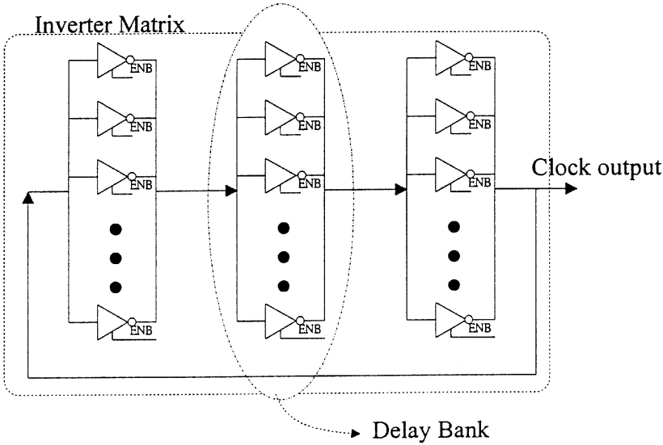
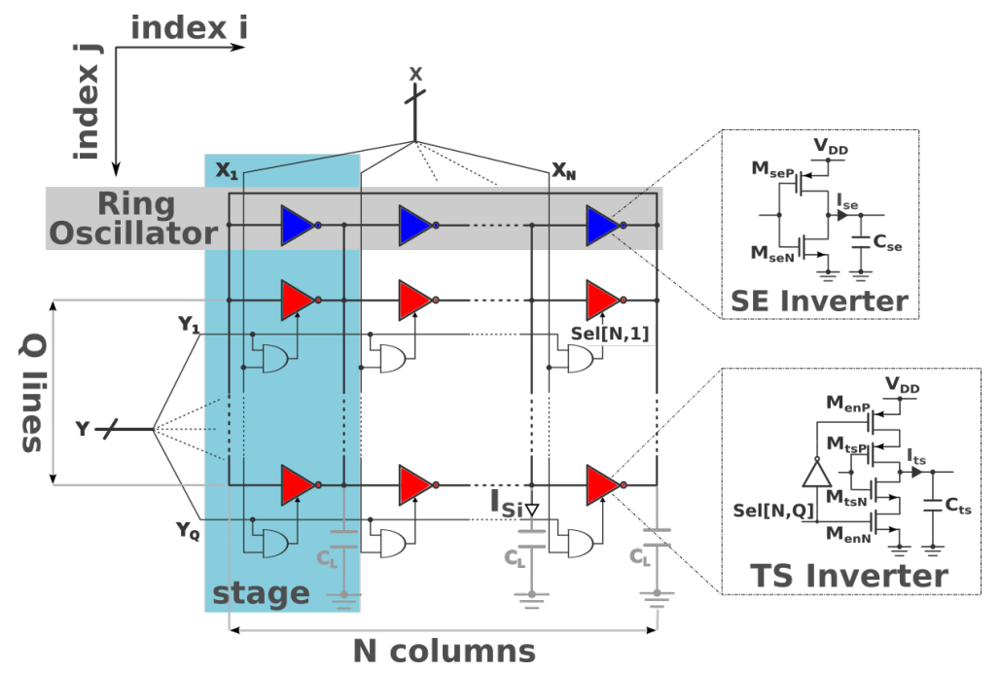
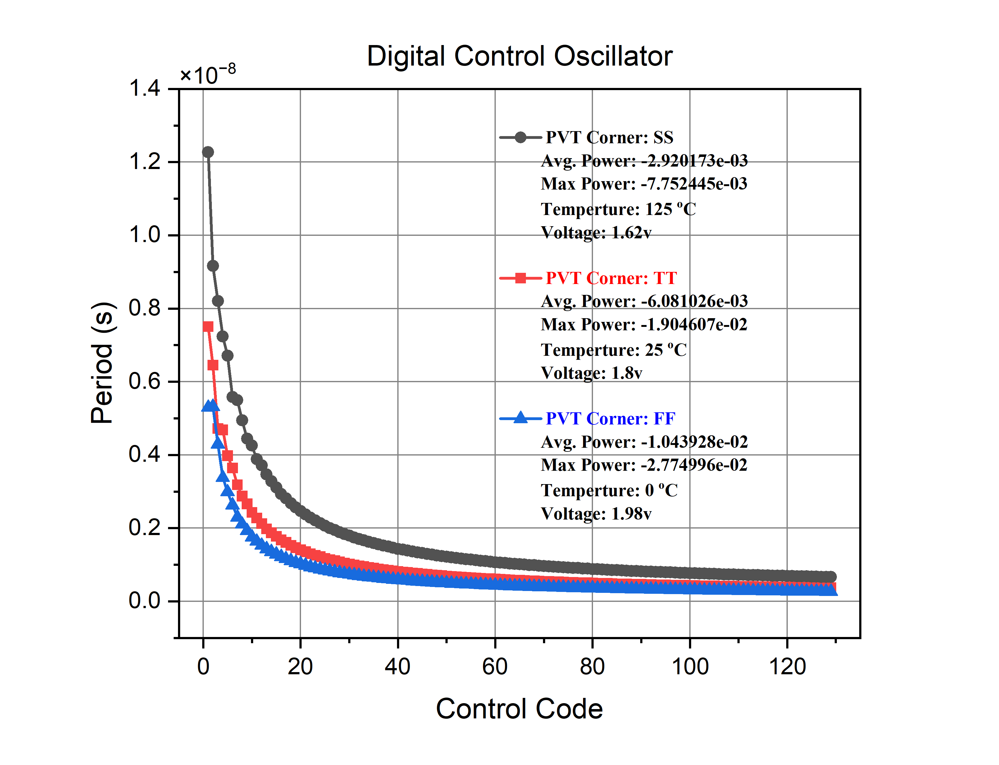
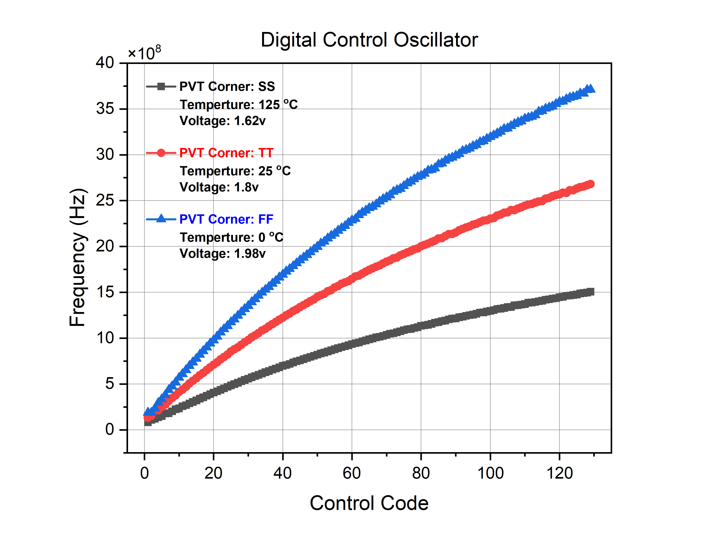
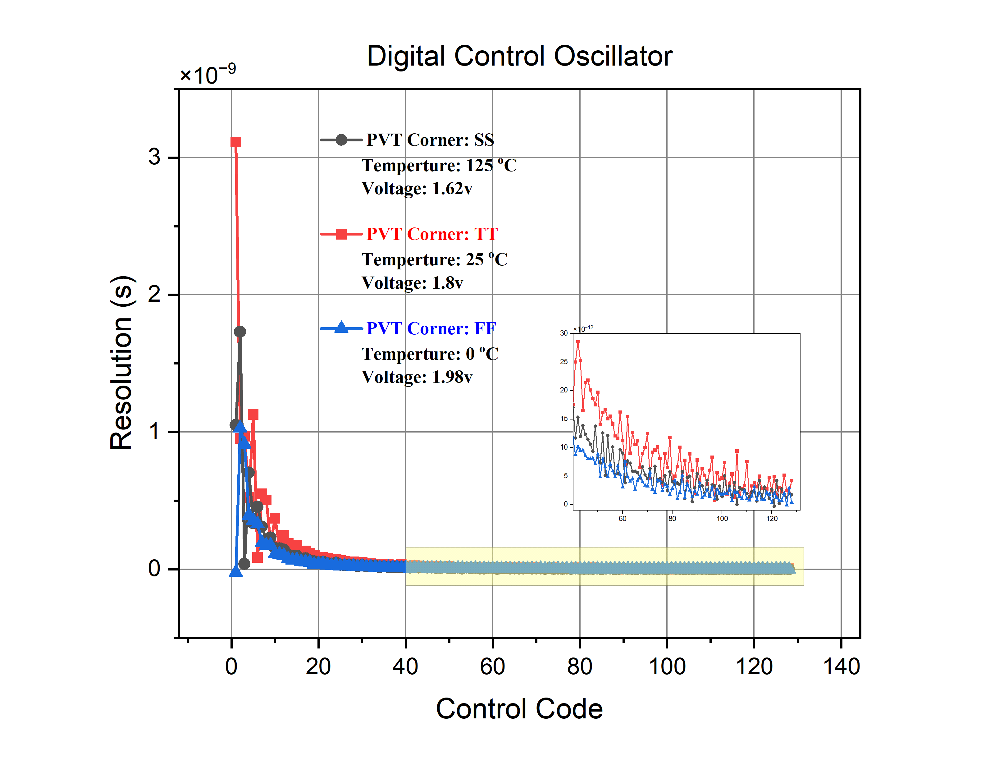
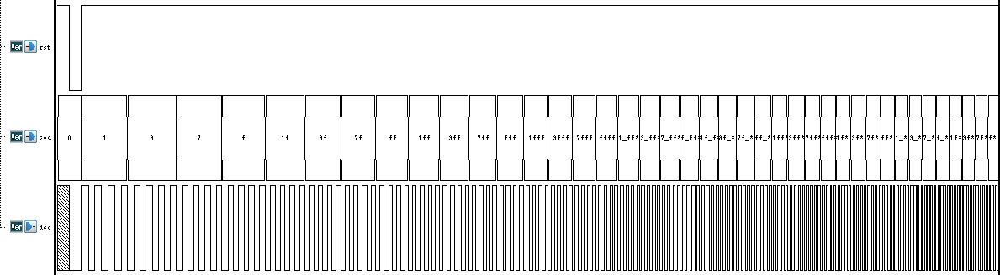

# Digital-Controlled Oscillator (DCO)

This folder contains the HSPICE simulation files for a Digital-Controlled Oscillator (DCO) based on a Tri-State Inverter architecture.

## Table of Contents
- [File Structure](#file-structure)
- [DCO Architecture](#dco-architecture)
    - [Overall structure of the DCO](#overall-structure-of-the-dco)
    - [Detailed schematic of the DCO](#detailed-schematic-of-the-dco)
- [Simulation Details](#simulation-details)
    - [Running the Simulation](#running-the-simulation)
    - [PVT Simulation](#pvt-simulation)
- [Behavioral Model](#behavioral-model)
- [References](#references)

## File Structure

- `dco.sp`: Main HSPICE simulation file for the DCO. It sets up the simulation conditions, and specifies the signals to monitor and measurements to take.

- `test_dco.v`: The testbench generates a test vector file (`dco.vec`) which is used to simulate the DCO's behavior under various input conditions. The testbench toggles the RESET signal and shifts a 129-bit code to test the DCO's response to different frequency control codes.

- `dco.vec`: This file contains the test vectors for the DCO simulation, including the RESET signal and the 129-bit digital control code.

- `run.tcl`: Script that automates the running of the Test Vector File (`dco.vec`) generation and the HSPICE (`dco.sp`) simulation.

- `behavior_model`: Folder containing the Verilog behavior model of the DCO.

## DCO Architecture
The architecture of the DCO is followed by [Terng-Yin Hsu, 2001](https://doi.org/10.1109/82.933795), architecture is show in Fig.1, and this DCO provide 128 different frequencies output.

### Overall structure of the DCO
This image shows the overall structure of the DCO, including the tri-state inverters and the control logic.  
  
Fig.1 Structure of the cell-based digital-controlled ring oscillator.

### Detailed schematic of the DCO
This image shows a detailed schematic of the DCO, including the individual components and their connections.  
  
Fig.2 Schematic view of the tri-state inverter based DCO.

## Simulation Details

The simulation uses the L18U18V_TT process library from the "hspice_model.122" file.

A transient analysis is performed, simulating the circuit over a time period of 1290 nanoseconds with a time step of 1 picosecond.

The simulation monitors the voltage at nodes B0, B1, and B2, and the current through VDD. It also measures the pin-to-pin delay, specifically the time it takes for the voltage at node B0 to rise from 50% of the supply voltage to the same level again, with a delay of 5 nanoseconds before the measurement starts.

### Running the Simulation

To run the simulation, you will need to have HSPICE installed on your system. 
You can then run the simulation with the TCL script in your terminal:

```bash
./run.tcl
```
This will run the simulation and output the results to the `dco.lis` file.

### PVT Simulation
The PVT (Process, Voltage, Temperature) simulation verifies the operating range of the DCO under different conditions, including:

1. Slow process ($SS$), low voltage (1.62V), high temperature (125^oC)
2. Typical process ($TT$), nominal voltage (1.8V), room temperature (25^oC)
3. Fast process ($FF$), high voltage (1.98V), low temperature (0^oC)

The following images show the `Period`、`Frequency`、`Resolution` result of the PVT simulation:

**Period - Control Code**


**Frequency - Control Code**


**Resolution - Control Code**


## Behavioral Model
The behavioral model of the DCO is written in Verilog and can be found in the `behavior_model/dco.v`. 

The model is based on the simulation results from the HSPICE simulation, and test all possible DCO control codes to verify the model, testbench is provided in `behavior_model/dco_test_top.sv`.

The following waveform shows the simulation result of all possible DCO control codes:  


## References
- Terng-Yin Hsu, Chung-Cheng Wang and Chen-Yi Lee, "Design and analysis of a portable high-speed clock generator," in IEEE Transactions on Circuits and Systems II: Analog and Digital Signal Processing, vol. 48, no. 4, pp. 367-375, April 2001, doi: 10.1109/82.933795.