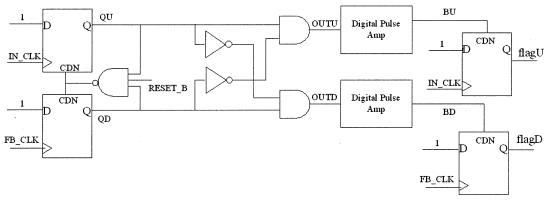
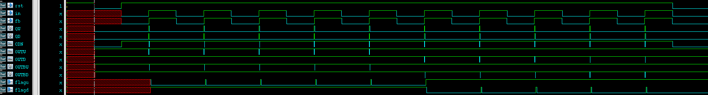

# Phase Frequency Detector (PFD)

This folder contains the HSPICE simulation files for a Phase Frequency Detector based on a Cell-based Bang-Bang architecture.

## Table of Contents
- [File Structure](#file-structure)
- [PFD Architecture](#pdf-architecture)
    - [Overall structure of the PFD](#overall-structure-of-the-pdf)
- [Simulation Details](#simulation-details)
    - [Running the Simulation](#running-the-simulation)
- [Behavioral Model](#behavioral-model)
- [References](#references)

## File Structure

- `pfd.sp`: HSPICE file containing the simulation details for the Phase Frequency Detector (PFD).

- `test_pattern.v`: Verilog file responsible for generating the input vector file (`pfd.vec`) for the PFD.

- `run.tcl`: Script that automates the running of the Test Vector File (`pfd.vec`) generation and the HSPICE (`pfd.sp`) simulation.

- `behavioral_model`: This directory contains the Verilog file (`pfd.v`) representing the behavioral model of the PFD, derived from HSPICE simulation results.

## PFD Architecture
The architecture of the PFD is followed by [Ching-Che Chung, 2003](https://doi.org/10.1109/JSSC.2002.807398), architecture is show in Fig.1.

### Overall structure of the PFD



Fig.1 Structure of the cell-based bang-bang PFD

## Simulation Details

The HSPICE simulation for the Phase Frequency Detector (PFD) is configured with key parameters specified in the `pfd.sp` file. Operating under slow process conditions with a 1.62V supply voltage and at 125°C, the simulation employs a transient analysis spanning 400 ns with a 1 ps time step. 

Output monitoring includes probes for crucial signals like `RESET_B`, `IN`, `FB`, `QU`, and `QD`. Analog signal monitoring focuses on signals such as `IN` and `FB`. Measurement commands assess average and peak power consumption. Global nets (`VDD` and `VSS`) and voltage sources (`vdd` and `vss`) are defined, while the digital vector input from `pfd.vec` is utilized to introduce specific vector patterns. 

### Running the Simulation
To run the simulation, you will need to have HSPICE installed on your system. 
You can then run the simulation with the TCL script in your terminal:

```bash
./run.tcl
```
This will run the simulation and output the results to the `pfd.lis` file.


## Behavioral Model
The behavioral model of the PFD is written in Verilog and can be found in the `behavior_model/pfd.v`. 

The model is based on the simulation results from the HSPICE simulation, testbench is provided in `behavior_model/pfd_test_top.sv`.

  
Fig. 2: Waveform of the PFD Behavioral Model

## References
- Ching-Che Chung and Chen-Yi Lee, "An all-digital phase-locked loop for high-speed clock generation," in IEEE Journal of Solid-State Circuits, vol. 38, no. 2, pp. 347-351, Feb. 2003, doi: 10.1109/JSSC.2002.807398.