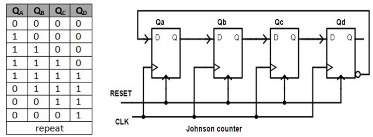
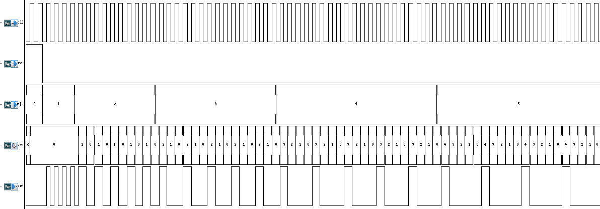

# Frequency Divider

This folder contains the Verilog files for a counter-based Frequency Divider.

## Table of Contents
- [Frequency Divider Method](#frequency-divider-method)
- [File Structure](#file-structure)
- [Simulation Details](#simulation-details)
- [Behavior](#behavior)

## Frequency Divider Method
The Frequency Divider is a N-bits Johnson Counter-based Frequency Divider, and can be used for 2N frequency division, and in this project, we use 3-bits to divide the output frequency by range 1~7.


Fig.1 Johnson Counter-based Frequency Divider

## File Structure
- `FREQ_DIV.v`: Verilog file containing the verilog model of the Frequency Divider.

- `FREQ_DIV_tb.v`: Verilog file containing the testbench for the Frequency Divider.

- `run.tcl`: Script that automates the running of the testbench.

## Simulation Details
To run the simulation, you can run the simulation with the TCL script in your terminal:

```bash
./run.tcl
```

## Behavior
The Frequency Divider is a counter-based divider that divides the input frequency, `M` is a 3-bits division factor that can be set 1 ~ 7. The output clock is `REF_CLK / M`. The simulation waveform is shown in Fig.2.


Fig.2: Waveform of the Frequency Divider