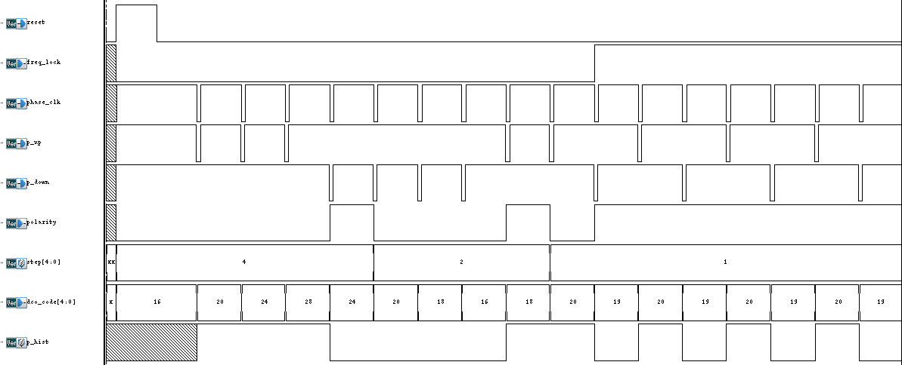

# Controller
The Controller is the core of the ADPLL, and it will lock the DCO frequency to the reference frequency.

## Table of Contents
- [Controller Method](#controller-method)
- [File Structure](#file-structure)
- [Simulation Details](#simulation-details)
- [Behavior](#behavior)

## Controller Method
The goal of the `CONTROLLER` is to lock the DCO frequency to the reference frequency. If the DCO frequency is too fast, the `CONTROLLER` will decrease the DCO control code, and vice versa.  
When the polarity changes, the `CONTROLLER` will modify the Frequency-Gain (Δ) to speed up the lock-in time.  
The search method illustrated in Fig.1, and the default value of Δ is 4, and will divide by 2 when the polarity changes.

  
Fig.1 Controller Binary Search Method

## File Structure
- `CONTROLLER.v`: Verilog file containing the verilog model of the Controller.

- `CONTROLLER_tb.v`: Verilog file containing the testbench for the Controller.

- `run.tcl`: Script that automates the running of the testbench.

## Simulation Details
To run the simulation, you can run the simulation with the TCL script in your terminal:

```bash
./run.tcl
```

## Behavior
The Controller is a binary search method that will lock the DCO frequency to the reference frequency. The simulation waveform is shown in Fig.2.

