# All-Digital Phase-Locked Loop (ADPLL)

In this project, we designed an All-Digital Phase-Locked Loop (ADPLL) in Verilog and HSPICE.  

The ADPLL is composed of a Digital-Controlled Oscillator (DCO), a Phase-Frequency Detector (PFD), a Controllor, a Filter, and a Frequency Divider.  

After completing the design, we verified the functionality of the ADPLL by behavior simulation and AMS simulation.

## Table of Contents
* [Specifications](#specifications)
* [Building Blocks](#building-blocks)
    * [TOP Module](#top-module)
    * [ADPLL](#adpll)
    * [PFD](#pfd)
    * [CONTROLLER](#controller)
    * [FILTER](#filter)
    * [DCO](#dco)
    * [FREQ_DIV](#freq_div)
    * [TEST](#test)
* [Simulation](#simulation)
    * [Demo 1 Behavior Simulation](#demo-1-behavior-simulation)
    * [Demo 2 AMS Simulation](#demo-2-ams-simulation)
    * [Re-lock Time](#re-lock-time)
    * [Period Jitter and Cycle-to-Cycle Jitter](#period-jitter-and-cycle-to-cycle-jitter)
* [Reference](#reference)

## Specifications
The specifications of the ADPLL are as follows:

<table>
    <thead>
        <tr>
        <th style="width:50%">Parameter</th>
        <th style="width:50%">Value</th>
        </tr>
    </thead>
    <tbody>
        <tr><td>Target Process</td> <td>UMC 0.18 um</td></tr>
        <tr><td>Reference Clock (MHZ)</td> <td>223 ~ 1792</td></tr>
        <tr><td>Output Clock (MHZ)</td> <td>223 ~ 1529</td></tr>
        <tr><td>Programmable Input and Feedback Divider</td> <td>1 ~ 7</td></tr>
        <tr><td>Lock-in Time (#cycle)</td> <td>6 / 59 (Min / Max)</td></tr>
        <tr><td>Re-lock Time (#cycle)</td> <td>6 / 59 (Min / Max)</td></tr>
        <tr><td>Output Jitter (ps)</td> <td>157 / 462 (J_PER / J_CC)</td></tr>
        <tr><td>Output Phase Drift (ps)</td> <td>11 / 980 (Min / Max)</td></tr>
        <tr><td>Power Consumption (mW)</td> <td>1.97 / 8.74 (Avg / Max)</td></tr>
    </tbody>
</table>

## Building Blocks
* `TOP.v` : Top module of the ADPLL and testbench.
* `ADPLL.v` : Instantiation of the DCO, PFD, Controller, Filter, and Frequency Divider.
* `PFD.sp` : HSPICE netlist of the Cell-based Bang-Bang PFD.
* `PFD.v` : Behavioral model of the PFD.
* `CONTROLLER.v` : Binary Search Controller.
* `FILTER.v` : Motorola's Loop Filter.
* `DCO.sp` : HSPICE netlist of the Tri-state Buffer based DCO.
* `DCO.v` : Behavioral model of the DCO.
* `FREQ_DIV.v` : N-bits Johnson Counter-based Frequency Divider.

* `TEST.v` : Testbench for the ADPLL.

### TOP Module
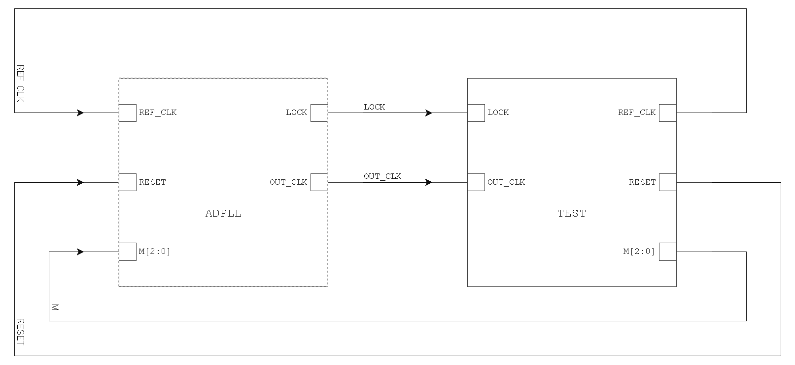
Fig.1 TOP Module Schematic

### ADPLL
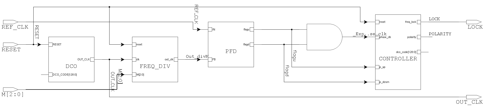
Fig.2 ADPLL Schematic

### PFD
The architecture of the PFD is followed by [Ching-Che Chung, 2003](https://doi.org/10.1109/JSSC.2002.807398) [1], showed in Fig.3, and this PFD only provide the polarity information (lead/lag) of the Input and Feedback signal.  

  
Fig.3 PFD Architecture

### CONTROLLER
The goal of the CONTROLLER is to lock the DCO frequency to the reference frequency. If the DCO frequency is too fast, the CONTROLLER will decrease the DCO control code, and vice versa.  
When the polarity changes, the CONTROLLER will modify the Frequency-Gain (Δ) to speed up the lock-in time.  
The search method illustrated in Fig.4, and the default value of Δ is 4, and will divide by 2 when the polarity changes.

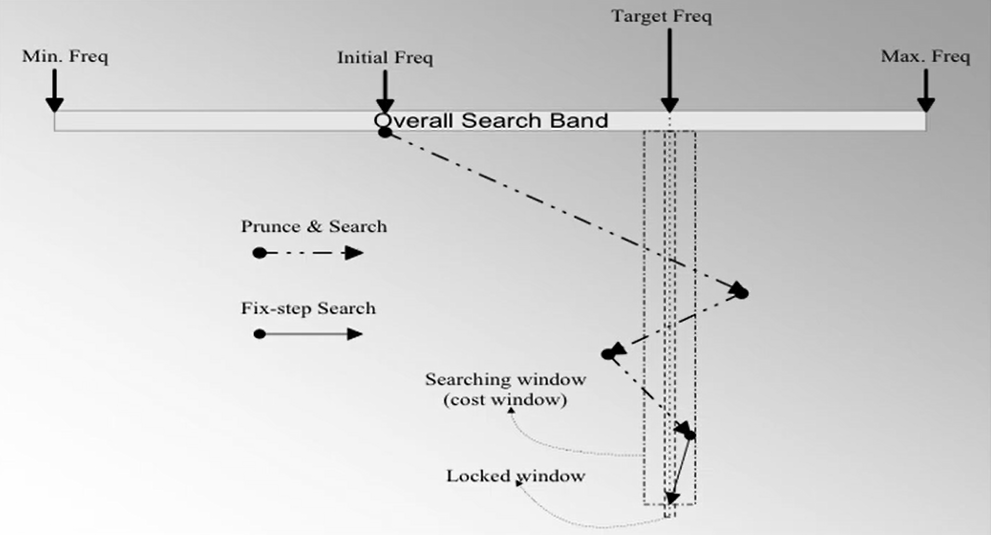  
Fig.4 Controller Binary Search Method

### FILTER
The Loop Filter is followed by [Motorola, 1996](https://patents.google.com/patent/US5506875A/en) [2], when the frequency search is done, the DCO control code will store in the anchor register. If 4 consecutive cycles have the same polarity (lead/lag), the anchor register will be updated by decreasing or increasing 1.

### DCO
The architecture of the DCO is followed by [Terng-Yin Hsu, 2001](https://doi.org/10.1109/82.933795) [3], architecture is show in Fig.5, and this DCO provide 128 different frequencies output.  

  
Fig.5 DCO Architecture

### FREQ_DIV
The Frequency Divider is a N-bits Johnson Counter-based Frequency Divider, and can be used for 2N frequency division, and in this project, we use 3-bits to divide the output frequency by range 1~7.

Fig.6 Johnson Counter-based Frequency Divider

### TEST
The testbench will test if the ADPLL can lock to the wide range of reference frequency, we'll test reference frequency in 7 different divider ratio and 50 different reference frequency, total 350 test cases.
* Reference Clock (`REF_CLK`) : 223.21 ~ 1792 MHz (4.48 ~ 0.558 ns)
* Divider Ratio (`M`) : 1 ~ 7

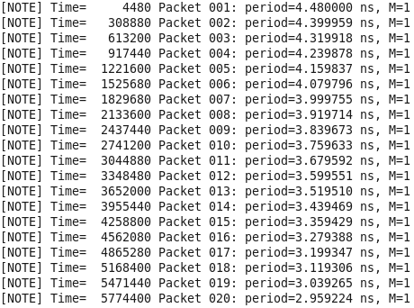
Fig.7 Test Cases

## Simulation
### Demo 1 Behavior Simulation
In the behavior simulation, we will show the ADPLL ability to track the reference clock (`REF_CLK`), and show the phase error between the output clock (`OUT_CLK`) and the reference clock (`REF_CLK`) in some cases, and will illustrate the difference between with and without the `FILTER` module.  
Lock-in Signal (`LOCK`) will be high when the ADPLL is locking to the reference clock, and will be low when the ADPLL is not locking to the reference clock.

#### Case 1 : M = 1, REF_CLK = 223.21 ~ 1792 MHz with Filter
In this case, when the reset signal (`RESET`) asserted, the `REF_CLK` will increase and the `DCO_CODE` will set to initial value. We can see the `DCO_CODE` converges in a small range after `LOCK` asserted (Fig.8, Fig.9).

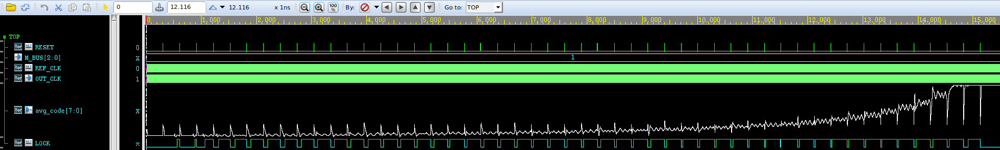
Fig.8 M = 1, REF_CLK = 223.21 ~ 1792 MHz  

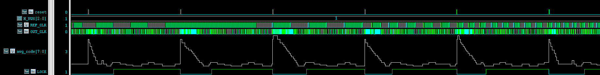
Fig.9 M = 1, REF_CLK = 223.21 ~ 1792 MHz (Zoom in)  

#### Case 2 : M = 1, REF_CLK = 250 MHz (Period = 4 ns) with Filter
In this case, after `LOCK` asserted, the `OUT_CLK` lock in Period = 3.736 ns (Fig.10), and the phase error between the `OUT_CLK` and the `REF_CLK` is around 0.3 ns (Fig.11).

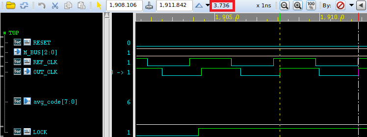
Fig.10 Lock-in Period  

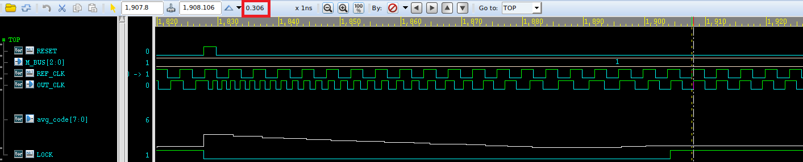
Fig.11 Phase Error  

#### Case 3 : M = 1 ~ 7, REF_CLK = 223.21 ~ 1792 MHz with Filter
In this case, we can see the `DCO_CODE` didn't locked in every reference clock (Fig.12), this is because the limitation of the `DCO` module.

M = 6, REF_CLK = 245.09 MHz (Period = 4.08 ns) is the boundary of our ADPLL, the correct output clock should be 1470 MHz (Period = 0.68 ns), and the `OUT_CLK` is 1529 MHz (Period = 0.654 ns) (Fig.13).  
If the correct `OUT_CLK` should be fast than 1470 MHz, the DCO will not lock-in (Fig.14).

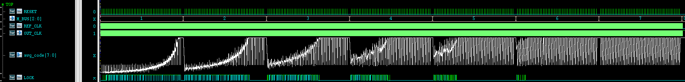
Fig.12 M = 1 ~ 7, REF_CLK = 223.21 ~ 1792 MHz  

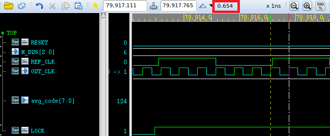
Fig.13 Reference Clock Boundary  

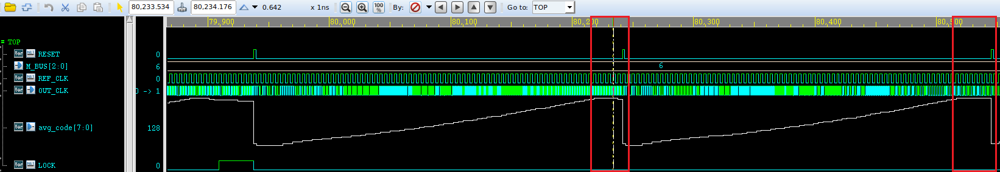
Fig.14 Non-lock-in  

#### Case 4 : M = 7, REF_CLK = 200 ~ 207 MHz (Period = 5 ~ 4.82 ns) with Filter
In this case, after `LOCK` asserted, the `DCO_CODE` will lock in a small range (Fig.15).  
In `M = 7, REF_CLK = 200 MHz (Period = 5 ns)`, after fine-tuning in a few cycles, the `OUT_CLK` Period = 0.776 ns (Fig.16), and the phase error is around 42 ps (Fig.17).

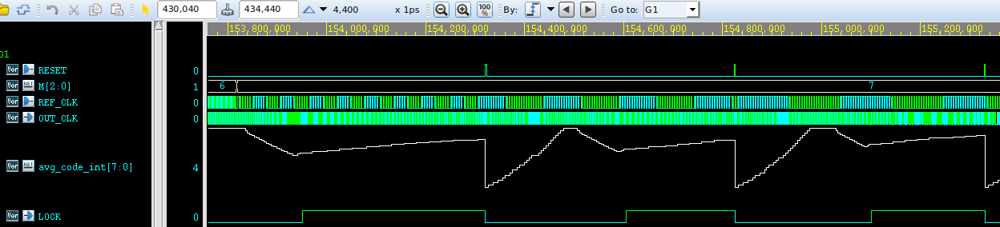
Fig.15 M = 7, REF_CLK = 200 ~ 207 MHz  

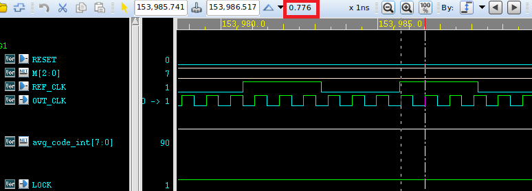
Fig.16 Fine-tuning Period  

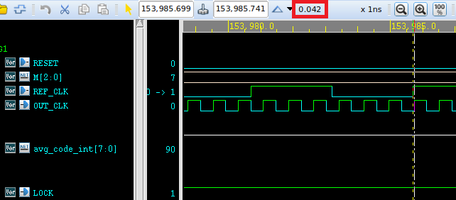
Fig.17 Fine-tuning Phase Error  

#### Case 5 : With and Without FILTER Module
In this case, we can see the `FILTER` module can significantly reduce the jitter of the DCO code.  
`avg_code` is the DCO code which add the Filter, and `dco_code_int` is the DCO code which without the Filter (Fig.18).  
`FILTER` activate when `LOCK` asserted, and when 4 consecutive cycles have the same polarity (lead/lag), the `avg_code` will be decreasing or increasing 1 (Fig.19).

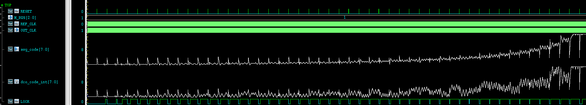
Fig.18 Jitter Reduction  

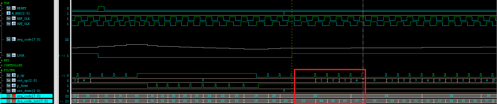
Fig.19 DCO Code Update Method  

### Demo 2 AMS Simulation
In the AMS simulation, we will change the DCO and PFD behavior model to HSPICE netlist, and simulate the ADPLL in the transistor level.  

#### Case 1 : M = 1, REF_CLK = 223.21 ~ 1792 MHz with Filter
In this case, when `RESET` asserted, the `REF_CLK` will increase and the `DCO_CODE` will set to initial value. We can see the `DCO_CODE` converges in a small range after `LOCK` asserted (Fig.20, Fig.21).

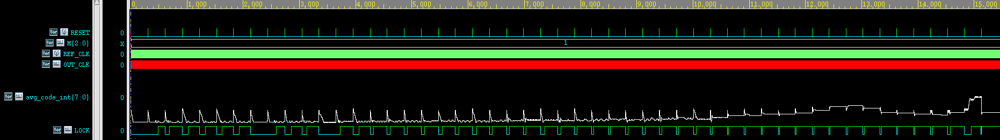
Fig.20 M = 1, REF_CLK = 223.21 ~ 1792 MHz  

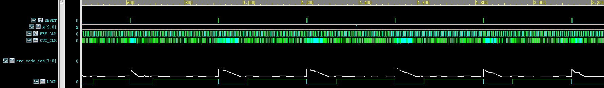
Fig.21 M = 1, REF_CLK = 223.21 ~ 1792 MHz (Zoom in)  

#### Case 2 : Packet 006, M = 1, REF_CLK = 250 MHz (Period = 4 ns) with Filter
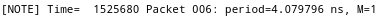  

In this case, after `LOCK` asserted, the `OUT_CLK` lock in Period = 5.553 ns (Fig.22), and the phase error between the `OUT_CLK` and the `REF_CLK` is around 0.45 ns (Fig.23).  
After fine-tuning in a few cycles, the `OUT_CLK` Period = 3.89 ns (Fig.24), and the phase error is around 0.28 ns (Fig.25).

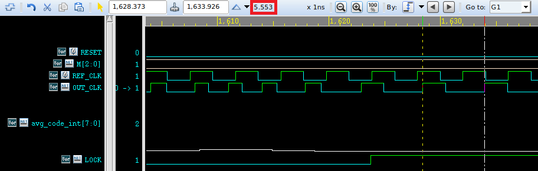
Fig.122 Lock-in Period  

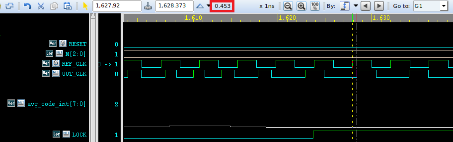
Fig.23 Lock-in Phase Error  

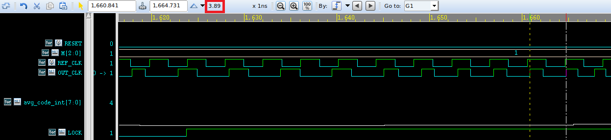
Fig.24 Fine-tuning Period  

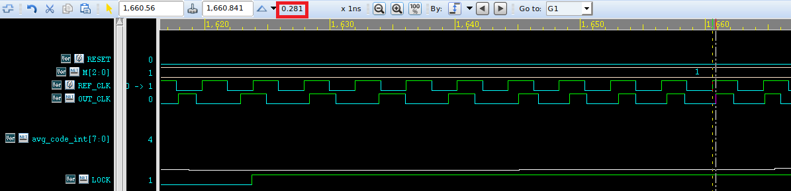
Fig.25 Fine-tuning Phase Error  

#### Case 3 : Packet 061, M = 2, REF_CLK = 271 MHz (Period = 3.68 ns) with Filter
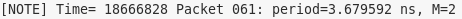  

In this case, `OUT_CLK` Period should be 1.84 ns, after `LOCK` asserted, the `OUT_CLK` lock in Period = 1.68 ns (Fig.26), and the phase error is around 153 ps (Fig.27).

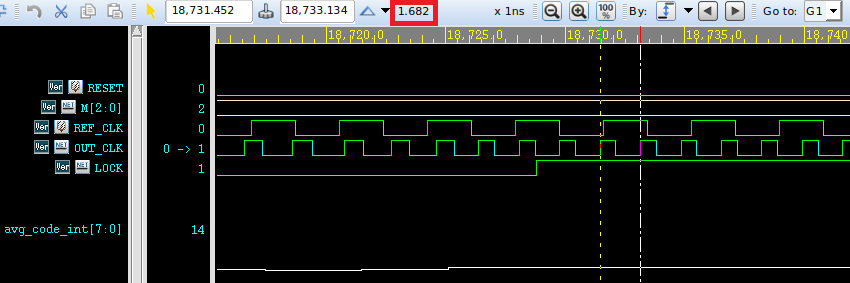
Fig.26 Lock-in Period  

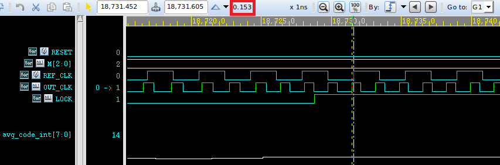
Fig.27 Lock-in Phase Error  

#### Case 4 : Packet 122, M = 3, REF_CLK = 357 MHz (Period = 2.8 ns) with Filter
  

In this case, `OUT_CLK` Period should be 0.933 ns, after `LOCK` asserted, the `OUT_CLK` lock in Period = 0.904 ns (Fig.28), and the phase error is around 400 ps (Fig.29).  
After fine-tuning in a few cycles, the `OUT_CLK` Period = 0.95 ns (Fig.30), and the phase error is around 11 ps (Fig.31).

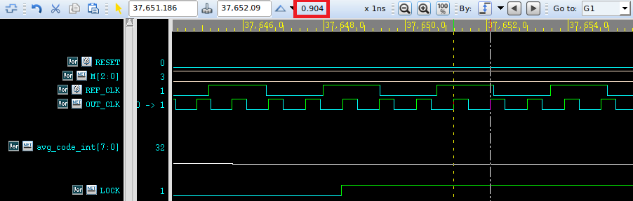
Fig.28 Lock-in Period  

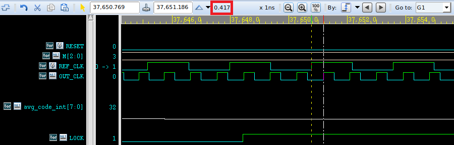
Fig.29 Lock-in Phase Error  

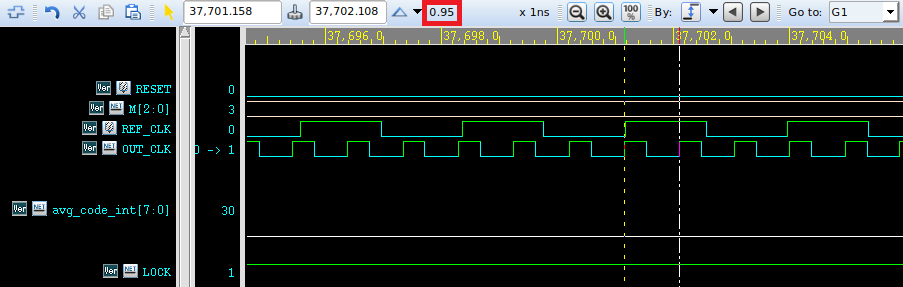
Fig.30 Fine-tuning Period  

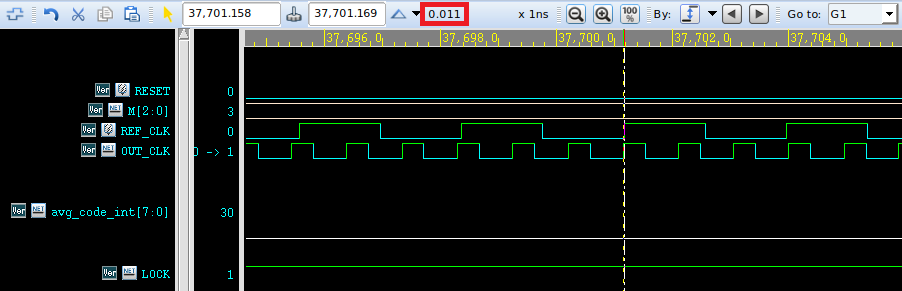
Fig.31 Fine-tuning Phase Error  

#### Case 5 : Packet 158, M = 4, REF_CLK = 255 MHz (Period = 3.92 ns) with Filter
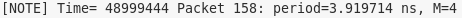  

In this case, `OUT_CLK` Period should be 0.98 ns, after `LOCK` asserted, the `OUT_CLK` lock in Period = 1.19 ns (Fig.32), and the phase error is around 0.28 ns (Fig.33).

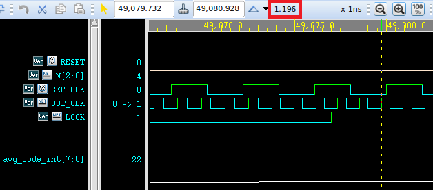
Fig.32 Lock-in Period  

Fig.33 Lock-in Phase Error  

#### Case 6 : Packet 213, M = 5, REF_CLK = 286 MHz (Period = 3.5 ns) with Filter
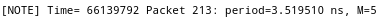  

In this case, `OUT_CLK` Period should be 0.7 ns, after `LOCK` asserted, the `OUT_CLK` lock in Period = 0.637 ns (Fig.34), and the phase error is around 83 ps (Fig.35).  
After fine-tuning in a few cycles, the `OUT_CLK` Period = 0.692 ns (Fig.36), and the phase error is around 18 ps (Fig.37).

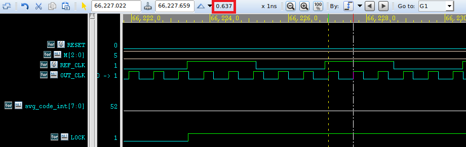
Fig.34 Lock-in Period  

Fig.35 Lock-in Phase Error  

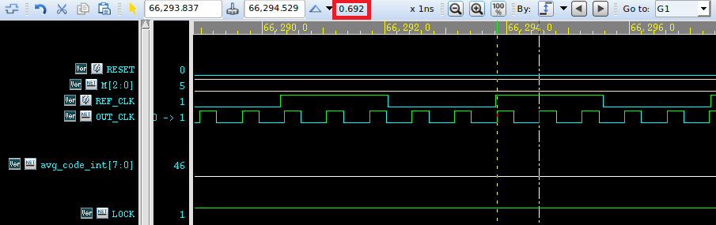
Fig.36 Fine-tuning Period  

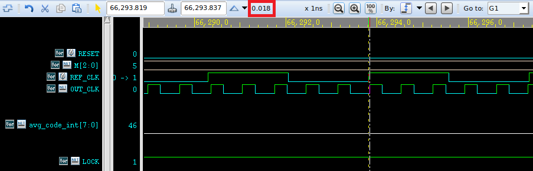
Fig.37 Fine-tuning Phase Error  

#### Case 7 : Packet 252, M = 6, REF_CLK = 227 MHz (Period = 4.4 ns) with Filter
  

In this case, `OUT_CLK` Period should be 0.733 ns, after `LOCK` asserted, the `OUT_CLK` lock in Period = 0.747 ns (Fig.38), and the phase error is around 27 ps (Fig.39).

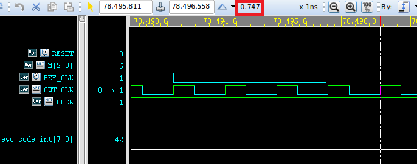
Fig.38 Lock-in Period  

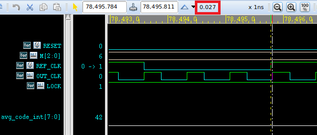
Fig.39 Lock-in Phase Error  

#### Case 8 : Packet 301, M = 7, REF_CLK = 223 MHz (Period = 4.48 ns) with Filter
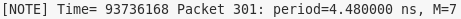  

In this case, `OUT_CLK` Period should be 0.64 ns, after `LOCK` asserted, the `OUT_CLK` lock in Period = 0.625 ns (Fig.40), and has no phase error (Fig.41).

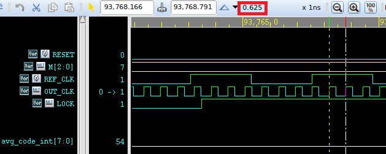
Fig.40 Lock-in Period  

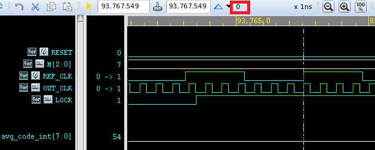
Fig.41 Lock-in Phase Error  

#### Case 9 : With and Without FILTER Module
In this case, we can see the `FILTER` module can significantly reduce the jitter of the DCO code.  
`FILTER` module is the same as in the [behavior simulation](#case-4--with-and-without-filter-module), and the `avg_code` is the DCO code which add the Filter, and `dco_code_int` is the DCO code which without the Filter (Fig.42).

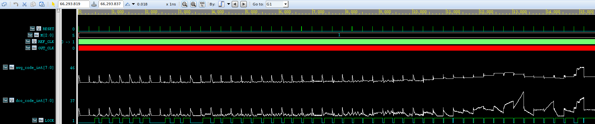
Fig.42 Jitter Reduction  

### Re-lock Time
The re-lock time responds to the input frequency change is showed in Fig.43, Max re-lock time is 59 cycles, and Min re-lock time is 6 cycles.

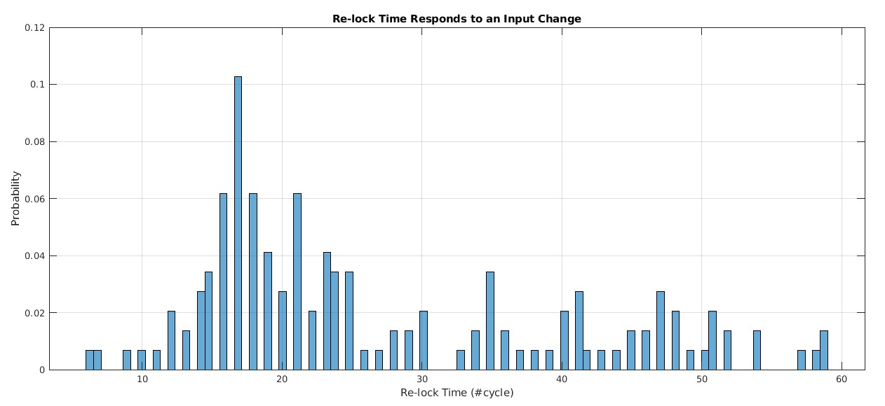
Fig.43 Re-lock Time  

### Period Jitter and Cycle-to-Cycle Jitter
The distribution of the Period Jitter (`J_PER`) and Cycle-to-Cycle Jitter (`J_CC`) in situation of `M = 2, REF_CLK = 250 MHz (Period = 4 ns)` is showed in Fig.44.

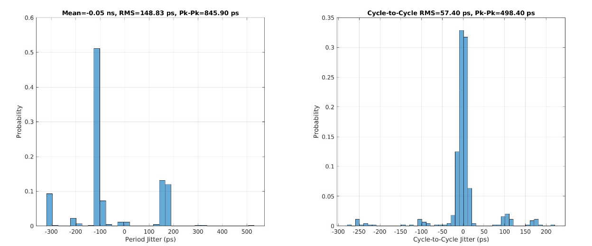
Fig.44 Left : Period Jitter Distribution, Right : Cycle-to-Cycle Jitter Distribution  

The distribution of the Period Jitter (`J_PER`) and Cycle-to-Cycle Jitter (`J_CC`) in situation of `M = 1, REF_CLK = 270 MHz (Period = 3.7 ns)` is showed in Fig.45.

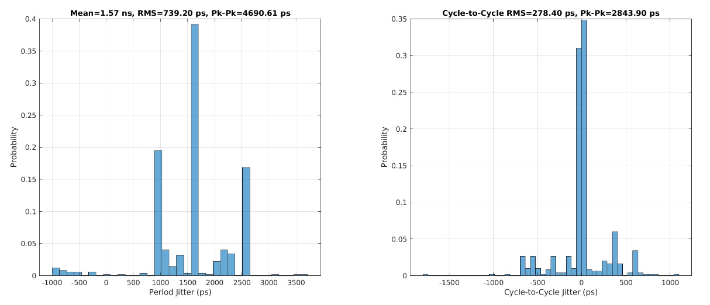
Fig.45 Left : Period Jitter Distribution, Right : Cycle-to-Cycle Jitter Distribution  

## Reference
[1] Ching-Che Chung and Chen-Yi Lee, "An all-digital phase-locked loop for high-speed clock generation," in IEEE Journal of Solid-State Circuits, vol. 38, no. 2, pp. 347-351, Feb. 2003, doi: 10.1109/JSSC.2002.807398.  
[2] Nuckolls, Charles E., James R. Lundberg, and Gerald W. Garcia. "Method and apparatus for performing frequency acquisition in all digital phase lock loop." U.S. Patent No. 5,506,875. 9 Apr. 1996.  
[3] Terng-Yin Hsu, Chung-Cheng Wang and Chen-Yi Lee, "Design and analysis of a portable high-speed clock generator," in IEEE Transactions on Circuits and Systems II: Analog and Digital Signal Processing, vol. 48, no. 4, pp. 367-375, April 2001, doi: 10.1109/82.933795.  